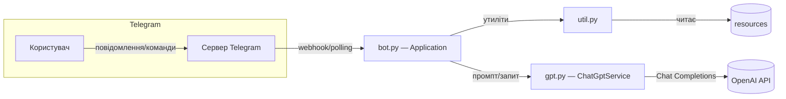

# TinderBolt — Telegram‑бот із інтеграцією ШІ‑агента

Україномовний Telegram‑бот, що поєднує сценарії спілкування з ChatGPT:
- звичайні питання до ШІ;
- «побачення з зіркою» (рольова переписка з персонажем);
- допомога з листуванням (генерація наступних реплік, запрошення на побачення);
- генерація Tinder‑профілю;
- генерація «опенера» — першого повідомлення для знайомства.

Проєкт побудований на `python-telegram-bot` та OpenAI Chat Completions. Код і ресурси розміщені у простій структурі з мінімальними залежностями.


## Зміст
- [Функціонал](#функціонал)
- [Архітектура](#архітектура)
- [Швидкий старт (локально)](#швидкий-старт-локально)
- [Запуск у Docker](#запуск-у-docker)
- [Деплой на хостинг](#деплой-на-хостинг)
- [Приклади](#приклади)
- [Структура проєкту](#структура-проєкту)
- [TODO](#todo)
- [Ліцензія](#ліцензія)


## Функціонал
- Команда `/start` — показує головне меню з кнопками й скидає режим.
- Команда `/gpt` — ставте довільні питання ChatGPT і отримуйте відповіді.
- Команда `/date` — оберіть персонажа й ведіть рольовий діалог (чат із «селебріті»).
- Команда `/message` — зберіть історію переписки та згенеруйте наступні репліки або запрошення на побачення.
- Команда `/profile` — заповніть дані, отримаєте згенерований Tinder‑профіль.
- Команда `/opener` — кілька питань і готовий перший меседж для знайомства.


## Архітектура

Основні модулі:
- `bot.py` — точки входу та всі хендлери Telegram, роутинг між режимами.
- `gpt.py` — клас `ChatGptService` для роботи з OpenAI Chat Completions (історія повідомлень, одноразові запити, системний промпт).
- `util.py` — утиліти Telegram (відправка тексту/HTML/кнопок/фото, меню команд), завантаження ресурсів, простий клас стану діалогу `Dialog`.
- `resources/` — зображення для підказок та текстові файли з повідомленнями і промптами.



Ключові потоки:
1) Команди (`/start`, `/gpt`, `/date`, `/message`, `/profile`, `/opener`) реєструються в `bot.py` та вмикають відповідні режими.
2) Для «довгих» діалогів `ChatGptService` тримає історію повідомлень з системним промптом.
3) Тексти і промпти зчитуються з `resources/messages` і `resources/prompts` через утиліти.

Детальні описи див. у документації:
- `docs/ARCHITECTURE.md`
- `docs/AI_TELEGRAM_BOT.md`
- `docs/modules/bot.py.md`, `docs/modules/gpt.py.md`, `docs/modules/util.py.md`


## Швидкий старт (локально)

Вимоги:
- Python 3.10+
- Створені токени: Telegram Bot Token, OpenAI API Key

1. Клонувати репозиторій і перейти в каталог проєкту.
2. Створити та активувати віртуальне середовище:
   - Windows PowerShell:
     ```powershell
     python -m venv .venv
     .\.venv\Scripts\Activate.ps1
     ```
   - macOS/Linux:
     ```bash
     python3 -m venv .venv
     source .venv/bin/activate
     ```
3. Встановити залежності:
   ```bash
   pip install -r requirements.txt
   ```
4. Налаштувати змінні середовища (важливо: не хардкодити токени в коді):
   - Windows PowerShell:
     ```powershell
     $env:TELEGRAM_BOT_TOKEN = "<TELEGRAM_BOT_TOKEN>"
     $env:OPENAI_API_KEY    = "<OPENAI_API_KEY>"
     # Необов’язково: базовий URL, якщо користуєтесь проксі/сумісним API
     # $env:OPENAI_BASE_URL   = "https://api.openai.com/v1"
     ```
   - macOS/Linux:
     ```bash
     export TELEGRAM_BOT_TOKEN="<TELEGRAM_BOT_TOKEN>"
     export OPENAI_API_KEY="<OPENAI_API_KEY>"
     # export OPENAI_BASE_URL="https://api.openai.com/v1"
     ```
5. Запустити бота:
   ```bash
   python bot.py
   ```

Примітка: поточна версія коду містить токени, вписані безпосередньо у `bot.py`. Для продакшна настійно рекомендується замінити їх читанням зі змінних середовища.


## Запуск у Docker

Приклад `Dockerfile` (можна скопіювати у корінь проєкту як `Dockerfile`):

```dockerfile
FROM python:3.12-slim

WORKDIR /app
COPY requirements.txt ./
RUN pip install --no-cache-dir -r requirements.txt
COPY . .

# Ніколи не хардкодьте секрети в образ
ENV TELEGRAM_BOT_TOKEN=""
ENV OPENAI_API_KEY=""
ENV OPENAI_BASE_URL="https://api.openai.com/v1"

CMD ["python", "bot.py"]
```

Збірка і запуск:

```bash
docker build -t tinderbolt .
docker run --rm \
  -e TELEGRAM_BOT_TOKEN=<TELEGRAM_BOT_TOKEN> \
  -e OPENAI_API_KEY=<OPENAI_API_KEY> \
  -e OPENAI_BASE_URL=https://api.openai.com/v1 \
  tinderbolt
```


## Деплой на хостинг
- Render / Railway / Fly.io / Koyeb / Docker‑хостинг: використайте контейнерний образ, передайте секрети як Environment Variables.
- Heroku: подібно, через Procfile/Container Registry.
- Важливо: якщо переходите з polling на webhook — налаштуйте публічний HTTPS URL і метод `setWebhook` у Bot API або через `python-telegram-bot`
  (цей репозиторій за замовчуванням використовує polling).


## Приклади

Команди:
```
/start   — показати меню
/gpt     — задати питання ChatGPT
/date    — обрати персонажа і вести рольовий діалог
/message — допомога з листуванням
/profile — згенерувати Tinder‑профіль
/opener  — згенерувати перший меседж
```

Фрагмент коду (псевдо) для одноразового питання до ШІ:

```python
from gpt import ChatGptService

service = ChatGptService(token=os.environ["OPENAI_API_KEY"])  # токен з ENV
answer = await service.send_question(
    prompt_text="You are helpful assistant",
    message_text="Explain TCP/IP in simple terms",
)
```


## Структура проєкту

Стисло (деталі — у `docs/PROJECT_MAP.md`):

```
bot.py                  # точки входу Telegram‑бота, хендлери, реєстрація команд
gpt.py                  # ChatGptService: робота з OpenAI Chat Completions
util.py                 # утиліти Telegram + завантаження ресурсів + Dialog
resources/
  images/               # зображення для підказок/меню
  messages/             # тексти повідомлень (UI/інструкції)
  prompts/              # системні та сценарні промпти
docs/                   # додаткова документація (архітектура, модулі, бот)
requirements.txt        # залежності Python
```


## TODO
- [ ] Перенести токени з коду в змінні середовища; додати читання з ENV у `bot.py`/`gpt.py`.
  - [ ] TELEGRAM_BOT_TOKEN
  - [ ] OPENAI_API_KEY
  - [ ] (необов’язк.) OPENAI_BASE_URL
- [ ] Додати обробку помилок мережі/квот із ретраями і тайм‑аутами.
- [ ] Ізолювати стан `Dialog` на рівні чату/користувача (уникнути глобального стану).
- [ ] Покращити валідацію введення та захист від проблем із Markdown/HTML.
- [ ] Додати інтеграційні тести для основних сценаріїв діалогу.
- [ ] Опціонально: підтримати режим webhook для продакшен‑деплою.


## Ліцензія
TBD — ліцензія буде визначена пізніше. Якщо плануєте відкриту публікацію, розгляньте MIT або Apache‑2.0.


---
Безпека: не зберігайте реальні токени у репозиторії. Використовуйте змінні середовища або менеджери секретів. У публічних PR замінюйте секрети на плейсхолдери.
