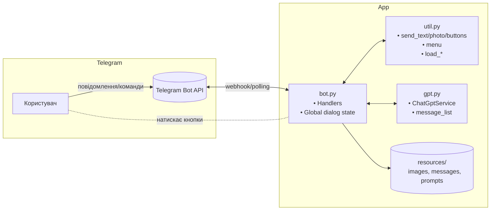
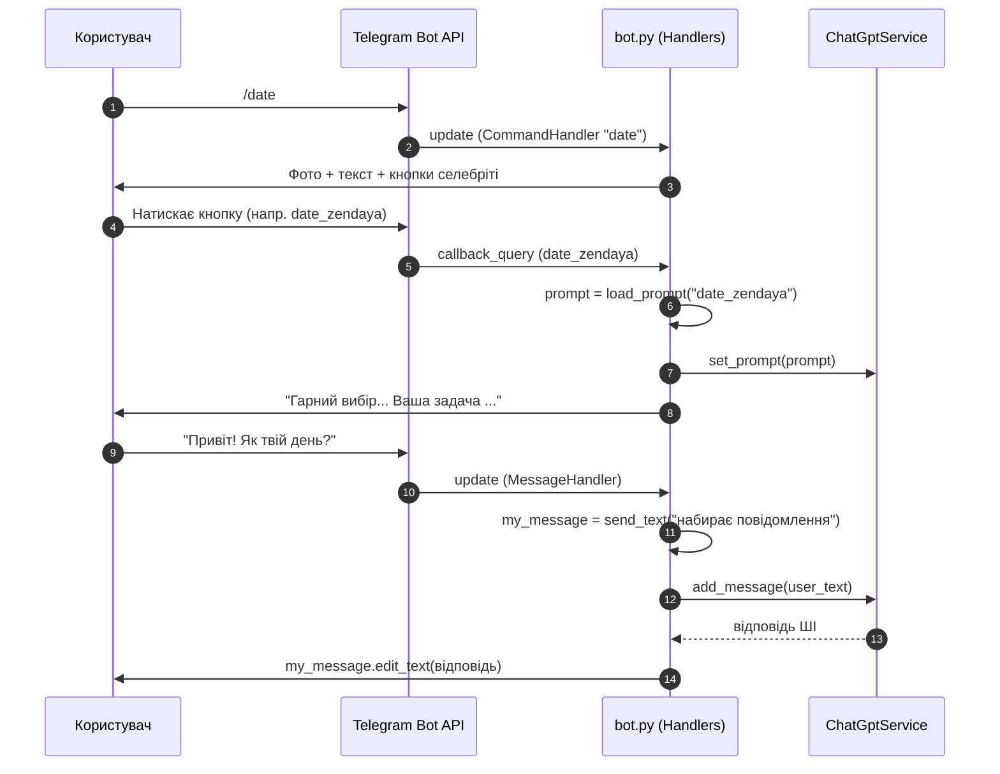

### Огляд: Telegram‑бот з інтеграцією ШІ

Цей документ описує логіку Telegram‑бота та інтеграцію з ШІ‑агентом (OpenAI) у проєкті. Висвітлено архітектуру, обробку команд, діалогову логіку, взаємодію з API ШІ, приклади запитів/відповідей та можливі помилки з рекомендаціями щодо обробки.


### Архітектура бота

Складові:
- Бот і хендлери (модуль `bot.py`): налаштування `ApplicationBuilder`, реєстрація `CommandHandler`/`MessageHandler`/`CallbackQueryHandler`, асинхронні хендлери команд і діалогів, глобальний стан `dialog`.
- Допоміжні утиліти (модуль `util.py`): надсилання повідомлень/фото/кнопок (`send_text`, `send_html`, `send_photo`, `send_text_buttons`), керування меню (`show_main_menu`, `hide_main_menu`), завантаження ресурсів (`load_message`, `load_prompt`), перетворення даних користувача (`dialog_user_info_to_str`), клас‑контейнер `Dialog`.
- ШІ‑сервіс (модуль `gpt.py`): клас `ChatGptService` — тонкий клієнт OpenAI Chat Completions (через SDK `openai`), підтримка контексту діалогу (`message_list`), методи `set_prompt`, `add_message`, `send_question`.
- Ресурси (`resources/`): зображення (`images/*.jpg`), текстові повідомлення (`messages/*.txt`), промпти для ШІ (`prompts/*.txt`).

#### Діаграма компонентів (Mermaid)




### Обробка команд

Команди реєструються у `bot.py`:
- `/start` → `start`: скидає режим, показує головне меню, надсилає вітальний текст і фото з `resources/messages/main.txt` та `resources/images/main.jpg`.
- `/gpt` → `gpt`: вмикає режим вільних питань до ШІ; подальші текстові повідомлення обробляє `gpt_dialog`.
- `/date` → `date`: показує кнопки зі «сценаріями побачення» (селебріті), їх обробляє `date_button`, а діалог веде `date_dialog`.
- `/message` → `message`: накопичує ваші вхідні повідомлення у `dialog.list`, потім за кнопками формує відповіді через ШІ (`message_button`).
- `/profile` → `profile`: покроково збирає дані для профілю в Tinder, завершує генерацією опису (`profile_dialog`).
- `/opener` → `opener`: збирає базову інформацію про співрозмовника й генерує «повідомлення‑відкривач» (`opener_dialog`).

Всі «звичайні» текстові повідомлення (не команди) роутяться в `hello`, який делегує у відповідний діалоговий хендлер згідно з `dialog.mode`.


### Логіка діалогів (state machine на глобальному `dialog`)

Глобальний стан:
- `dialog.mode`: активний режим (`gpt`, `date`, `message`, `profile`, `opener` або `None`).
- `dialog.list`: тимчасовий буфер повідомлень користувача (режим `/message`).
- `dialog.user`: словник відповідей користувача (режими `/profile`, `/opener`).
- `dialog.counter`: крок діалогу (послідовність запитань).

Основні сценарії:
- GPT Q&A (`/gpt`):
  - `gpt_dialog`: бере текст користувача → `prompt = load_prompt("gpt")` → `chatgpt.send_question(prompt, text)` → повертає відповідь.
- Побачення зі зіркою (`/date`):
  - `date` показує варіанти (кнопки), `date_button` завантажує конкретний промпт (напр. `date_zendaya`) і викликає `chatgpt.set_prompt(prompt)`.
  - `date_dialog` продовжує діалог: кожне повідомлення користувача → `chatgpt.add_message(text)` → відповідь у треді (з контекстом попередніх обмінів).
- Переписка від вашого імені (`/message`):
  - `message` очищає `dialog.list`, показує кнопки «написати наступне»/«запросити на побачення».
  - Кожне текстове повідомлення → `message_dialog` додає у `dialog.list`.
  - Натиск кнопок → `message_button`: формує `user_chat_history = "\n\n".join(dialog.list)`, читає відповідний промпт (`message_next` або `message_date`) і звертається до ШІ `send_question(prompt, history)`.
- Генерація профілю (`/profile`):
  - `profile_dialog` кроками збирає атрибути (`age`, `occupation`, `hobby`, `annoys`, `goals`). На фінальному кроці: `prompt = load_prompt("profile")`, `user_info = dialog_user_info_to_str(dialog.user)`, далі `chatgpt.send_question(prompt, user_info)`.
- Повідомлення‑відкривач (`/opener`):
  - Аналогічно до профілю: збір `name`, `age`, `handsome`, `occupation`, `goals` → формування `user_info` → `send_question("opener", user_info)`.


### Взаємодія з API ШІ

Клас `ChatGptService` (`gpt.py`) інкапсулює роботу з OpenAI Chat Completions:
- `set_prompt(prompt_text)`: скидає контекст і додає системне повідомлення (`{"role":"system","content": prompt}`) — використовується для сценаріїв із тредом (`/date`).
- `add_message(message_text) -> str`: додає `{"role":"user","content": ...}` і надсилає всю `message_list` у API; повертає відповідь.
- `send_question(prompt_text, message_text) -> str`: одноразовий запит — встановлює `system`+`user` і відправляє; зручно для генерацій без попереднього контексту (`/gpt`, фінальні кроки `/profile` та `/opener`, кнопки `/message`).

Параметри моделі: `model="gpt-4o"`, `max_tokens=3000`, `temperature=0.9`. Відповідь береться з `completion.choices[0].message`, який також додається до `message_list` для збереження контексту.


### Приклади запитів і відповідей (псевдокод)

Приклад 1 — вільне запитання (`/gpt`):
```text
Користувач: Поясни різницю між списком і кортежем у Python.
Бот: (завантажує prompts/gpt.txt як system) → виклик send_question(system_prompt, user_text)
Відповідь ШІ: Списки змінні, кортежі — ні. ...
```

Приклад 2 — сценарій «побачення» з контекстом (`/date` + кнопка `date_zendaya`):
```text
Користувач: /date → (натискає «Зендея»)
Бот: set_prompt(prompts/date_zendaya.txt)
Користувач: Привіт! Як твій день?
Бот: add_message("Привіт! Як твій день?") → відповідь у стилі Зендеї
Користувач: Хочеш прогулятися ввечері?
Бот: add_message("Хочеш прогулятися ввечері?") → відповідь із розвитком діалогу
```

Приклад 3 — «переписка» конденсація історії (`/message`):
```text
Користувач: /message → пише кілька власних реплік (накопичуються в dialog.list)
Користувач: тисне «Запросити на побачення»
Бот: load_prompt("message_date"), history = "\n\n".join(dialog.list)
     → send_question(prompt, history) → повертає сформульовану пропозицію
```

Приклад 4 — побудова Tinder‑профілю (`/profile`):
```text
Користувач: /profile → відповідає на 5 запитань
Бот: на 5‑му кроці формує user_info через dialog_user_info_to_str(user)
     і викликає send_question("profile", user_info)
```


### Можливі помилки та їх обробка

Проблеми з форматуванням Markdown:
- У `send_text` є перевірка на непарну кількість символів `_` (може ламати Markdown). У разі помилки користувач отримує пояснення і пропозицію скористатися HTML. Рекомендація: при підозрі на спеціальні символи використовувати `send_html` або екранувати Markdown.

Відсутні ресурси:
- Якщо немає файлу зображення чи тексту (`resources/images/*.jpg`, `resources/messages/*.txt`, `resources/prompts/*.txt`) — виклик `open(...)` впаде. Рекомендації: 
  - додати захист через `try/except FileNotFoundError` із дружнім повідомленням;
  - попередня перевірка наявності файлів під час деплою.

Помилки Telegram API:
- Невалідний `chat_id`, видалені повідомлення при `edit_text`, ліміти частоти. Рекомендації: 
  - обгортати надсилання/редагування у `try/except` та робити degrade (надсилати нове повідомлення замість редагування);
  - логувати `update.effective_chat.id`, `update.effective_user.id`.

Помилки ШІ‑сервісу (OpenAI):
- Сіткові збої, ліміти токенів, зміна API‑моделі. Рекомендації:
  - retry з експоненційною затримкою на мережеві помилки;
  - обрізання історії діалогу або зниження `max_tokens`;
  - централізований перехоплювач помилок у методах `ChatGptService` з повідомленням користувачу.

Стан і багатокористувацькість:
- Поточна реалізація використовує глобальний `dialog` для всіх чатів, що призводить до перетинання станів різних користувачів. Рекомендації: 
  - зберігати стан у мапі `state[chat_id] = Dialog()` або використовувати `telegram.ext` `ConversationHandler`/`ContextTypes.user_data`;
  - скидати стан при `/start` і виході з режимів.

Безпека секретів:
- Токени Telegram і OpenAI жорстко прописані у `bot.py`. Рекомендації:
  - зберігати секрети в змінних середовища/.env або у сховищі секретів;
  - не комітити секрети у VCS.

Валідація вводу:
- Поля на кшталт віку, рейтингів, імен — без перевірки. Рекомендації:
  - перевіряти числові значення (`age`, `handsome` 1–10);
  - санітизувати текст (довжина, заборонені символи) перед надсиланням у ШІ.

Inline‑кнопки і callback‑дані:
- Для `date_button` і `message_button` використовуються патерни `^date_.*`, `^message_.*`. Рекомендації:
  - перевіряти відповідність `query` відомим ключам перед доступом до ресурсів.


### Послідовність для сценарію `/date` (Mermaid)




### Корисні посилання на модулі
- `bot.py`: головні хендлери, ініціалізація бота, реєстрація команд і повідомлень.
- `gpt.py`: `ChatGptService` (інтеграція з OpenAI Chat Completions API).
- `util.py`: відправка повідомлень/фото/кнопок, форматування, робота з ресурсами та командним меню.


### Висновок
Бот реалізує кілька сценаріїв взаємодії з ШІ: вільне Q&A, рольові діалоги з контекстом, конденсацію історії листування, генерацію профілю та «опенерів». Центральними точками є хендлери в `bot.py`, утиліти в `util.py` та клієнт ШІ в `gpt.py`. Для надійності виробничого рівня рекомендовано впровадити ізоляцію стану на чат, обробку винятків/ретраї, валідацію вводу та безпечне зберігання секретів.
