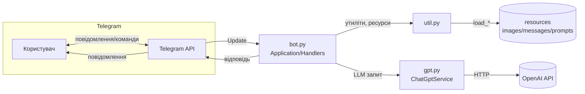
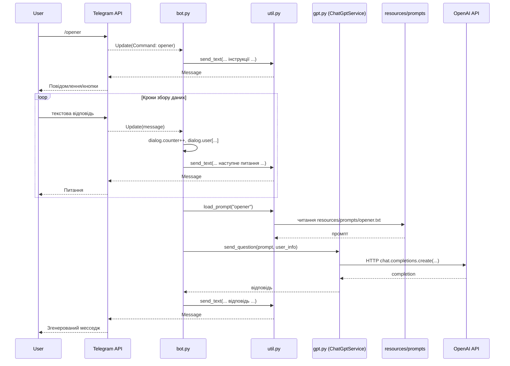

### Архітектура TinderBolt (Telegram Bot)

Цей документ описує логіку застосунку, основні модулі, точки входу та взаємодію між компонентами. Додаються діаграми компонентів і послідовності викликів.

#### Огляд
- Призначення: Telegram‑бот для генерації відповідей/повідомлень і допомоги у підготовці профілю/діалогів на основі LLM (OpenAI API через обгортку `ChatGptService`).
- Підхід: подієво‑орієнтована архітектура (update/handler) на базі `python-telegram-bot`. Логіка діалогів і команд зосереджена в `bot.py`. Допоміжні утиліти — в `util.py`. Інтеграція з LLM — у `gpt.py`. Контент (промпти/повідомлення/зображення) — у директорії `resources`.

---

### Основні модулі

1) `bot.py` — оркестратор застосунку
   - Імпортує утиліти (`util.py`) та сервіс LLM (`gpt.py`).
   - Створює глобальні об’єкти: `dialog` (стан сесії користувача) і `chatgpt` (клієнт OpenAI).
   - Будує Telegram‑додаток: `ApplicationBuilder().token(...).build()`.
   - Реєструє хендлери команд: `/start`, `/gpt`, `/date`, `/message`, `/profile`, `/opener`.
   - Реєструє хендлер тексту (без команд) — маршрутизує до активного діалогу (`hello()` викликає відповідний `*_dialog`).
   - Реєструє обробники callback‑кнопок (pattern `^date_.*`, `^message_.*`).
   - Запускає цикл обробки оновлень: `app.run_polling()` — основна точка входу процесу.

2) `util.py` — утиліти Telegram та ресурси
   - `send_text()`, `send_html()`, `send_text_buttons()` — уніфіковані способи надсилання повідомлень, з обробкою Markdown/HTML і клавіатур.
   - `send_photo()` — відправка зображень із `resources/images`.
   - `show_main_menu()`, `hide_main_menu()` — конфігурація команд і меню чату.
   - `load_message()`, `load_prompt()` — доступ до текстових ресурсів у `resources/messages` та `resources/prompts`.
   - `dialog_user_info_to_str()` — агрегує введені користувачем атрибути в читабельний текст.
   - `class Dialog` — контейнер стану (зберігає `mode`, `list`, `user`, `counter`).

3) `gpt.py` — інтеграція з OpenAI
   - Клас `ChatGptService` інкапсулює клієнта `openai.OpenAI(...)` і чергу повідомлень (`message_list`).
   - Підтримує два патерни взаємодії з LLM:
     - Діалоговий: `set_prompt()` ➜ `add_message()` ➜ внутрішній `send_message_list()`.
     - Одноразове запитання: `send_question(prompt, message)` — формує контекст і виконує запит.

4) `resources/*`
   - `images/` — ілюстрації для повідомлень.
   - `messages/` — статичні тексти інтерфейсу/підказок для користувача.
   - `prompts/` — системні інструкції (промпти) для LLM під різні сценарії (`gpt`, `opener`, `date_*`, тощо).

---

### Точки входу та життєвий цикл обробки

1) Старт застосунку
   - Запуск інтерпретатора на `bot.py` ініціалізує `Application` і викликає `app.run_polling()` — процес чекає нових `Update` від Telegram.

2) Команди користувача
   - Повідомлення з `/start` або іншою командою перехоплює відповідний `CommandHandler` у `bot.py`.
   - Команда зазвичай:
     - Показує меню/кнопки або надсилає вступне повідомлення.
     - Встановлює режим діалогу в `dialog.mode` (наприклад, `"opener"`, `"date"`, `"gpt"`).

3) Ввід тексту
   - Увесь текст без команд обробляє `MessageHandler(..., hello)`.
   - `hello()` маршрутизує у відповідний діалоговий обробник: `gpt_dialog()`, `date_dialog()`, `message_dialog()`, `profile_dialog()`, `opener_dialog()` — залежно від `dialog.mode`.

4) Діалогові обробники
   - Кожен `*_dialog` крокує по питаннях, накопичує відповіді в `dialog.user` і/або `dialog.list`, інкрементує `dialog.counter`.
   - Коли всі вхідні дані зібрані, формує запит до LLM через `chatgpt.send_question(prompt, user_info)` або веде діалог через `set_prompt`/`add_message`.

5) Callback‑кнопки
   - `CallbackQueryHandler` з `pattern` спрямовує натискання у відповідні обробники (наприклад, `date_button`, `message_button`), які реагують на вибір користувача (фільтри типу `^date_.*`).

---

### Взаємодія між компонентами (діаграма компонентів)

---

### Приклад послідовності викликів: сценарій «/opener»

---

### Потоки даних і стан
- Стан діалогу: глобальний об’єкт `dialog` у `bot.py` з полями `mode`, `list`, `user`, `counter`.
  - Примітка: у поточній реалізації стан спільний для процесу; для реальної багатокористувацької роботи потрібна ізоляція по `chat_id`/`user_id` (наприклад, мапа `chat_id ➜ Dialog`).
- Ресурси: файли `*.txt` завантажуються через `load_message()`/`load_prompt()`; зображення — через `send_photo()`.
- Інтеграція з LLM: `ChatGptService` підтримує історію повідомлень (`message_list`) у пам’яті процесу.

---

### Помилки, логування, обмеження
- Обробка помилок: мінімальна (переважно покладання на винятки бібліотек). Рекомендовано додати `try/except` навколо I/O та викликів OpenAI/Telegram, з користувацькими повідомленнями про помилки.
- Логування: використовується `print` у валідації Markdown (`send_text`). Варто інтегрувати структуроване логування (наприклад, `logging`).
- Обмеження Markdown/HTML: `send_text()` перевіряє кількість `_` та радить `send_html()` при невалідності.

---

### Безпека та секрети
- Токени Telegram і OpenAI наразі захардкожені у `bot.py`. Це ризик ексфільтрації секретів. Рекомендації:
  - Зберігати секрети в змінних середовища або `.env` (із додаванням до `.gitignore`).
  - Валідувати відсутність секретів у репозиторії на CI сканером секретів.

---

### Напрямки поліпшення архітектури
- Ізоляція стану за користувачем: словник `chat_id -> Dialog` або FSM (finite state machine) на користувача.
- Рознести діалоги по модулях (наприклад, `dialogs/opener.py`, `dialogs/profile.py`) для кращої підтримуваності.
- Ввести шар сервісів/юзкейсів (application layer) між хендлерами Telegram та інфраструктурою (OpenAI, файлові ресурси).
- Обробка помилок і ретраї для зовнішніх викликів (Telegram/OpenAI).
- Тестування: модульні тести для утиліт і діалогових сценаріїв із моками Telegram/OpenAI.
