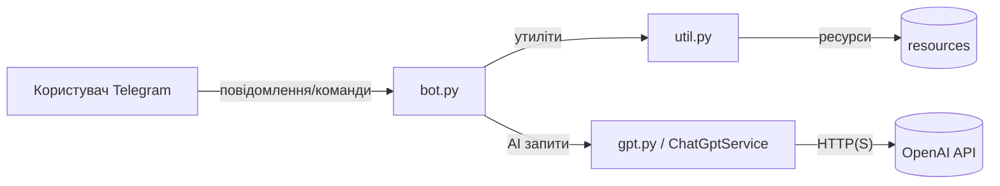

# Developer Guide

Цей посібник для розробників описує, як працювати з проєктом TinderBolt: локальне розгортання (Windows), Docker Compose, додавання нових команд бота, інтеграція нових моделей ШІ, оновлення залежностей, логування та деплой.

Документ розрахований на «середню глибину» і спирається на код `bot.py`, `gpt.py`, `util.py` та документацію в каталозі `docs/`.

---

## 1) Передумови
- Windows 10/11
- Python 3.11+ (рекомендовано)
- Телеграм-бот токен (`TELEGRAM_BOT_TOKEN`)
- Ключ OpenAI (`OPENAI_API_KEY`) — нині клієнт використовує `base_url="https://openai.javarush.com/v1"`
- (Опційно) Docker Desktop для Windows

Корисні файли:
- `README.md` — короткий огляд і швидкий старт
- `docs/ARCHITECTURE.md` — архітектура проєкту
- `docs/AI_TELEGRAM_BOT.md` — логіка бота й інтеграція з ШІ
- `docs/TEST_PLAN.md` — плани тестів

Примітка щодо секретів: у поточній версії `bot.py` токени захардкожені для демонстраційних цілей. У продакшні наполегливо рекомендуємо винести секрети в змінні середовища або `.env` і прочитувати їх у коді (див. розділ «Безпека та конфігурація» нижче).

---

## 2) Локальне розгортання (Windows, pip/venv)

Нижче — приклад у PowerShell.

1. Клонувати/відкрити проєкт у директорії `D:\TinderBolt`.
2. Створити та активувати віртуальне середовище:
   ```powershell
   cd D:\TinderBolt
   py -3 -m venv .venv
   .\.venv\Scripts\Activate.ps1
   ```
3. Встановити залежності:
   ```powershell
   pip install --upgrade pip
   pip install -r requirements.txt
   ```
4. Налаштувати змінні середовища (рекомендовано; нинішній код не читає їх, див. примітку):
   ```powershell
   $env:TELEGRAM_BOT_TOKEN = "<TELEGRAM_BOT_TOKEN>"
   $env:OPENAI_API_KEY    = "<OPENAI_API_KEY>"
   ```
5. Запустити бота:
   ```powershell
   python bot.py
   ```

Перевірка: у консолі має з’явитися лог запуску, а в Telegram — бот почне відповідати на `/start` та інші команди.

---

## 3) Запуск у Docker Compose

Приклад мінімального `docker-compose.yml` (зберегти у корені проєкту):

```yaml
version: "3.9"
services:
  tinderbolt:
    image: python:3.12-slim
    working_dir: /app
    volumes:
      - ./:/app
    environment:
      TELEGRAM_BOT_TOKEN: ${TELEGRAM_BOT_TOKEN}
      OPENAI_API_KEY: ${OPENAI_API_KEY}
    # За бажанням: додайте HTTP(S) proxy змінні, якщо потрібно
    command: bash -lc "pip install --no-cache-dir -r requirements.txt && python bot.py"
    restart: unless-stopped
    healthcheck:
      test: ["CMD", "python", "-c", "import socket; print('ok')"]
      interval: 30s
      timeout: 5s
      retries: 3
```

Файл `.env` поряд із `docker-compose.yml`:

```
TELEGRAM_BOT_TOKEN=<TELEGRAM_BOT_TOKEN>
OPENAI_API_KEY=<OPENAI_API_KEY>
```

Команди:
```powershell
docker compose up -d    # запуск у фоні
docker compose logs -f  # перегляд логів
docker compose down     # зупинка
```

Примітка: нині код бере токени з констант у `bot.py`. Для справжнього продакшну потрібно зчитувати їх із env — див. розділ «Безпека та конфігурація».

---

## 4) Як додати нову команду бота

Кроки на прикладі команди `/ping`:

1. Додайте хендлер у `bot.py`:
   ```python
   async def ping(update, context):
       """Повертає pong і демонструє базову відповідь."""
       await send_text(update, context, "pong")
   ```

2. Зареєструйте команду у застосунку:
   ```python
   from telegram.ext import CommandHandler
   
   app.add_handler(CommandHandler("ping", ping))
   ```

3. (Опційно) Додайте кнопку до головного меню в `start()` або через `show_main_menu()` з `util.py`.

4. Якщо команда має діалоговий режим:
   - призначте `dialog.mode = "ping"` у командному хендлері;
   - створіть відповідний діалоговий хендлер `ping_dialog()`;
   - маршрутизуйтесь у `hello()` за значенням `dialog.mode`.

5. Ресурси:
   - Для статичних описів використовуйте `resources/messages/` і завантажуйте їх через `load_message()`.
   - Для системних промптів — `resources/prompts/` та `load_prompt()`.

6. Тестування: додайте кейси в `docs/TEST_PLAN.md` і покрийте:
   - коректну реєстрацію `CommandHandler`;
   - логіку діалогу (за потреби, з моками Telegram).

---

## 5) Інтеграція нових моделей ШІ

Поточна реалізація — клас `ChatGptService` у `gpt.py` з методом `send_message_list()` і моделлю за замовчуванням `gpt-4o`.

Варіант A — інша модель OpenAI:
- Змініть значення `model` у `send_message_list()` на потрібне (наприклад, `gpt-4-turbo`).

Варіант B — інший провайдер/ендпоінт (адаптерний підхід):
1. Створіть новий сервіс із сумісним інтерфейсом:
   ```python
   class MyAiService:
       def __init__(self, token: str, base_url: str):
           # ініціалізація клієнта провайдера
           self.message_list = []

       def set_prompt(self, prompt_text: str) -> None:
           self.message_list.clear()
           self.message_list.append({"role": "system", "content": prompt_text})

       async def add_message(self, message_text: str) -> str:
           self.message_list.append({"role": "user", "content": message_text})
           return await self.send_message_list()

       async def send_message_list(self) -> str:
           # виклик API конкретного провайдера
           return "...assistant reply..."

       async def send_question(self, prompt_text: str, message_text: str) -> str:
           self.message_list = [
               {"role": "system", "content": prompt_text},
               {"role": "user", "content": message_text},
           ]
           return await self.send_message_list()
   ```
2. Підміняйте інстанс у `bot.py` (місце створення `chatgpt = ChatGptService(...)`) на ваш сервіс.

Поради:
- Додавайте таймаути/ретраї на рівні HTTP‑клієнта.
- Обмежуйте `max_tokens` і `temperature` у конфігурації.
- Логувати промпти обережно (маскувати PII/секрети).

---

## 6) Оновлення залежностей (pip/requirements.txt)

Додавання пакета:
```powershell
pip install <package>
pip freeze > requirements.txt
```

Оновлення на останні патчі/мінорні версії (обережно для мажорних):
```powershell
pip install --upgrade -r requirements.txt
pip freeze > requirements.txt
```

Рекомендації:
- Пінити версії (в `requirements.txt`) для відтворюваності.
- Перевіряти changelog бібліотек перед мажорним оновленням.
- Перевіряти сумісність зі `python-telegram-bot` та `openai` SDK.

---

## 7) Логування

Базова конфігурація (приклад для `bot.py`):
```python
import logging

logging.basicConfig(
    level=logging.INFO,
    format="%(asctime)s %(levelname)s [%(name)s] %(message)s",
)
logger = logging.getLogger("tinderbolt")

# Використання:
logger.info("Bot starting...")
logger.error("Error while handling update", exc_info=True)
```

Лог у файл із ротацією:
```python
import logging
from logging.handlers import RotatingFileHandler

handler = RotatingFileHandler("logs/app.log", maxBytes=5_000_000, backupCount=3, encoding="utf-8")
handler.setFormatter(logging.Formatter("%(asctime)s %(levelname)s [%(name)s] %(message)s"))

root = logging.getLogger()
root.setLevel(logging.INFO)
root.addHandler(handler)
```

Поради:
- Не логувати повні токени/PII. Маскуйте секрети.
- У продакшні розділяти рівні для консолі та файлу.

---

## 8) Деплой (Docker Compose)

Кроки:
1. Створіть `.env` із секретами (див. розділ про Compose).
2. Переконайтеся, що порти/мережі дозволені політиками вашого середовища.
3. Запустіть `docker compose up -d`.
4. Налаштуйте моніторинг і перезапуск (`restart: unless-stopped`).

Рекомендації продакшну:
- Зберігайте секрети поза репозиторієм (тільки `.env` локально/в CI секретах).
- Додавайте healthchecks і алерти (watchdog або зовнішній моніторинг).
- Використовуйте теги версій образів і pin версій залежностей.

---

## 9) Безпека та конфігурація

- Перенесіть токени з `bot.py` у змінні середовища:
  - `TELEGRAM_BOT_TOKEN`
  - `OPENAI_API_KEY`
- У коді зчитуйте їх через `os.environ["..."]`. При відсутності — кидати зрозумілу помилку.
- Не комітьте реальні ключі в репозиторій; використовуйте плейсхолдери в прикладах.

---

## 10) Тестування

Орієнтуйтесь на `docs/TEST_PLAN.md`.

Запуск pytest (приклад):
```powershell
pytest -q
```

Для async‑тестів використовуйте `pytest-asyncio`. Для Telegram та OpenAI — моки/фікстури.

---

## 11) Вирішення проблем (Troubleshooting)

- Бот не стартує: перевірте мережу/проксі, версії `python-telegram-bot` і Python, налаштування токенів.
- 401/403 від OpenAI: неправильний ключ або `base_url`.
- Emoji/Markdown зламують формат: використовуйте `send_html()` або перевірте обробку підкреслень у `send_text()`.
- Кнопки не працюють: перевірте патерни `CallbackQueryHandler` у `bot.py`.

---

## 12) Діаграма контексту (Mermaid)



---

Гайд підтримується у файлі `docs/DEVELOPER_GUIDE.md`. За потреби доповнюйте новими розділами (наприклад, CI/CD, міграції конфігурацій, алертинг).
