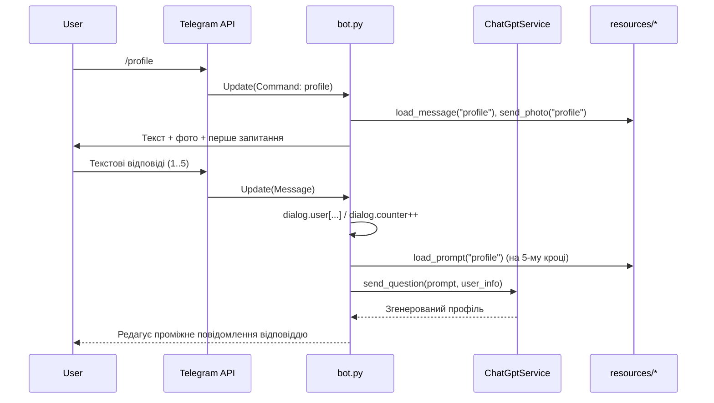

### Модуль: bot.py — Telegram‑бот (оркестратор діалогів)

Цей модуль є точкою входу та основним оркестратором застосунку на базі бібліотеки `python-telegram-bot`. Він реєструє хендлери команд і повідомлень, керує глобальним станом діалогу, взаємодіє з сервісом ChatGPT (`ChatGptService` з `gpt.py`) та утилітами з `util.py` для відправлення повідомлень/кнопок/зображень і завантаження текстових ресурсів.

#### Призначення
- Ініціалізація `Application` та запуск полінгу Telegram (`app.run_polling()`).
- Реєстрація `CommandHandler`/`MessageHandler`/`CallbackQueryHandler`.
- Перемикання «режимів» діалогу (gpt, date, message, profile, opener) через глобальний стан `dialog`.
- Послідовна взаємодія з ChatGPT для генерації відповідей/профілю/опенерів залежно від сценарію.

#### Залежності
- Зовнішні:
  - `python-telegram-bot` (ApplicationBuilder, Handlers, filters, ParseMode тощо).
  - OpenAI SDK (через `ChatGptService` із `gpt.py`).
- Внутрішні:
  - `gpt.py`: клас `ChatGptService` для звернень до Chat Completions API.
  - `util.py`: функції `send_text`, `send_html`, `send_text_buttons`, `send_photo`, `show_main_menu`, `hide_main_menu`, `load_message`, `load_prompt`, допоміжна `dialog_user_info_to_str`, клас‑контейнер `Dialog`.
- Ресурси:
  - `resources/messages/*.txt` — статичні тексти сценаріїв.
  - `resources/prompts/*.txt` — промпти для ChatGPT.
  - `resources/images/*.jpg` — ілюстрації для екранів/режимів.

#### Точки входу та ініціалізація
- Глобальні об’єкти:
  - `dialog = Dialog()` із динамічними полями: `mode: Optional[str]`, `list: list[str]`, `user: dict[str,str]`, `counter: int`.
  - `chatgpt = ChatGptService(token=...)` — клієнт OpenAI.
  - `app = ApplicationBuilder().token("<TELEGRAM_BOT_TOKEN>").build()` — застосунок Telegram.
- Реєстрація хендлерів:
  - Команди: `/start`, `/gpt`, `/date`, `/message`, `/profile`, `/opener` → відповідні async‑функції.
  - Текстові повідомлення (без команд) → `hello()` маршрутизує у відповідний діалог за `dialog.mode`.
  - Callback‑кнопки: `date_button` (pattern `^date_.*`), `message_button` (pattern `^message_.*`).
- Запуск: `app.run_polling()`.

---

### Опис функцій (хендлерів)

Нижче наведено публічні async‑функції, які використовуються як хендлери Telegram. Параметри у всіх: `update: telegram.Update`, `context: telegram.ext.ContextTypes.DEFAULT_TYPE`. Повертають `None` (використовуються побічні ефекти над Telegram‑чатом).

1) `start(update, context)`
- Призначення: скидає режим, показує головне меню, відправляє базовий контент.
- Дії: 
  - `dialog.mode = None`;
  - `send_photo("main")`, `load_message("main")`, `send_text()`;
  - `show_main_menu()` з командами: start, profile, opener, message, date, gpt.
- Параметри/типи: як вище.
- Повернення: `None`.

2) `gpt(update, context)`
- Призначення: вмикає режим «gpt», готує вступне повідомлення і картинку.
- Дії: `dialog.mode = "gpt"`; `send_photo("gpt")`; `send_text(load_message("gpt"))`.

3) `gpt_dialog(update, context)`
- Призначення: обробляє текст користувача в режимі `gpt` та отримує відповідь від ChatGPT.
- Дії: завантажує промпт `load_prompt("gpt")`, викликає `chatgpt.send_question(prompt, text)` та відповідає через `send_text`.

4) `date(update, context)`
- Призначення: вмикає режим «date» (спілкування із «зірками»), показує варіанти кнопками.
- Дії: `dialog.mode = "date"`; `send_photo("date")`; `send_text_buttons()` із кнопками `date_grande`, `date_robbie`, `date_zendaya`, `date_gosling`, `date_hardy`.

5) `date_button(update, context)`
- Призначення: обробляє натискання однієї з кнопок `date_*`.
- Дії: відповідає на callback; показує відповідне фото; надсилає пояснення; завантажує промпт `load_prompt(query)` і викликає `chatgpt.set_prompt(prompt)` для подальшого листування в цьому контексті.

6) `date_dialog(update, context)`
- Призначення: надсилає поточне повідомлення користувача в контексті попередньо встановленого промпта.
- Дії: показує «набирає повідомлення…», викликає `chatgpt.add_message(text)`, редагує проміжне повідомлення відповіддю.

7) `message(update, context)`
- Призначення: режим «message» для підготовки власного ланцюжка повідомлень користувача.
- Дії: `dialog.mode = "message"`; відправляє фото+текст; показує кнопки `message_next` і `message_date`; очищає `dialog.list`.

8) `message_dialog(update, context)`
- Призначення: накопичує текстові повідомлення користувача у `dialog.list`.
- Дії: додає `text` в `dialog.list`.

9) `message_button(update, context)`
- Призначення: на підставі натисненої кнопки формує промпт і звертається до ChatGPT з історією користувача.
- Дії: `prompt = load_prompt(query)`; `user_chat_history = "\n\n".join(dialog.list)`; проміжне повідомлення «Думаю…»; `chatgpt.send_question(prompt, user_chat_history)`; редагування відповіді.

10) `profile(update, context)`
- Призначення: запуск сценарію побудови профілю Tinder.
- Дії: `dialog.mode = "profile"`; фото+текст; `dialog.user.clear()`; `dialog.counter = 0`; ставить перше запитання («Скільки вам років?»).

11) `profile_dialog(update, context)`
- Призначення: покроково збирає дані користувача для профілю та на 5‑му кроці генерує профіль через ChatGPT.
- Дії по кроках (за `dialog.counter`):
  1 — `age`; 2 — `occupation`; 3 — `hobby`; 4 — `annoys`; 5 — `goals` → `prompt = load_prompt("profile")`, `user_info = dialog_user_info_to_str(dialog.user)`, повідомлення «генерує…», `chatgpt.send_question()`, редагування відповіді.

12) `opener(update, context)`
- Призначення: запуск сценарію генерації першого повідомлення для знайомства.
- Дії: `dialog.mode = "opener"`; фото+текст; `dialog.user.clear()`; `dialog.counter = 0`; перше запитання («Ім'я партнера?»).

13) `opener_dialog(update, context)`
- Призначення: покроково збирає базові відомості про партнера та на 5‑му кроці генерує «опенер» через ChatGPT.
- Дії по кроках: 1 — `name`; 2 — `age`; 3 — `handsome` (оцінка 1‑10); 4 — `occupation`; 5 — `goals` → `prompt = load_prompt("opener")`, `user_info = dialog_user_info_to_str(dialog.user)`, «генерує…», `chatgpt.send_question()`, редагування відповіді.

14) `hello(update, context)`
- Призначення: маршрутизатор для звичайних текстових повідомлень (без команд). Викликає відповідний `*_dialog` згідно `dialog.mode`.

15) `buttons_handler(update, context)`
- Призначення: приклад/заготовка загального обробника callback‑кнопок (у поточному коді обробляє лише `start/stop`).

---

### Приклади використання (псевдокод)

```python
# Запуск бота (спрощено)
app = ApplicationBuilder().token("<TELEGRAM_BOT_TOKEN>").build()

app.add_handler(CommandHandler("start", start))
app.add_handler(CommandHandler("gpt", gpt))
app.add_handler(CommandHandler("date", date))
app.add_handler(CommandHandler("message", message))
app.add_handler(CommandHandler("profile", profile))
app.add_handler(CommandHandler("opener", opener))

app.add_handler(MessageHandler(filters.TEXT & ~filters.COMMAND, hello))
app.add_handler(CallbackQueryHandler(date_button, pattern=r"^date_.*"))
app.add_handler(CallbackQueryHandler(message_button, pattern=r"^message_.*"))

app.run_polling()
```

```python
# Приклад взаємодії у режимі profile (спрощено)
await profile(update, context)              # показує інструкції й ставить перше запитання
await profile_dialog(update_with_age, ctx)  # 1: age
await profile_dialog(update_with_job, ctx)  # 2: occupation
await profile_dialog(update_with_hobby, ctx)# 3: hobby
await profile_dialog(update_with_annoys,ctx)# 4: annoys
await profile_dialog(update_with_goals, ctx)# 5: goals → GPT генерує профіль
```

---

### Діаграма послідовності (Mermaid)



---

### Можливі edge cases та зауваження
- Стан `dialog` глобальний та спільний для всіх чатів. У разі кількох користувачів може відбуватися взаємне перетинання станів. Рекомендація: зберігати стан на рівні `chat_id`/`user_id`.
- Валідація вводу відсутня (вік, діапазони оцінки 1–10, порожні рядки). Додати перевірки та переспитування.
- Markdown‑екранування: `send_text` перевіряє парність `_`, інакше радить `send_html`. У реальних відповідях GPT часто бувають спецсимволи — варто або завжди використовувати HTML‑режим, або екранувати Markdown.
- Довгі відповіді GPT (>4096 символів) можуть не поміститися в одне повідомлення Telegram. Потрібне нарізання на частини.
- Помилки мережі/квоти OpenAI: обробляти винятки навколо викликів `chatgpt.*` і показувати дружні повідомлення.
- Безпека секретів: токени Telegram та OpenAI у поточному коді захардкожені. Винести у змінні середовища/конфіги.
- Файли ресурсів: відсутність файлу призведе до `FileNotFoundError`. Слід додати перевірки існування або fallback‑повідомлення.
- Callback‑кнопки: у `buttons_handler` приклади `start/stop` не використовуються в реєстрації. Поточний функціонал для кнопок реалізовано окремими хендлерами `date_button` і `message_button` з regex‑патернами.
- Конкурентність: редагування повідомлення (`edit_text`) може кидати помилки, якщо вихідний `Message` втрачено або змінено. Додати обробку виключень.
- Локалізація: усі тексти українською; якщо планується мультимова — винести копірайтинг в окремі ресурсні файли.

---

### Короткі сигнатури та повернення
- Усі хендлери — `async def ... (update: Update, context: ContextTypes.DEFAULT_TYPE) -> None`.
- Функції взаємодіють із Telegram через побічні ефекти (надсилають/редагують повідомлення, фото, кнопки).

---

### Пов’язані модулі
- `gpt.py` — сервіс взаємодії з OpenAI (див. `docs/modules/gpt.py.md`).
- `util.py` — утиліти Telegram і робота з ресурсами (див. `docs/modules/util.py.md`).
